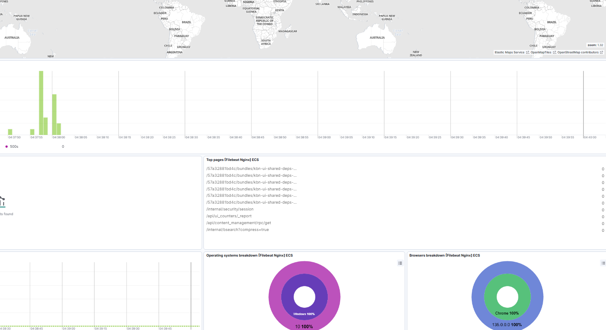

Kiên trúc
Filebeat -> logstash -> ES : dành do tùy chỉnh nâng cao, phức tạp, tốn hiệu năng
filebeat -> ES: dành cho log đơn giản, ít cần tùy chỉnh thêm.

## 1.	Cài đặt
Link tham khảo: https://www.elastic.co/guide/en/beats/filebeat/7.17/filebeat-installation-configuration.html 
```
cd /home/tuanda
wget https://artifacts.elastic.co/downloads/beats/filebeat/filebeat-8.17.4-linux-x86_64.tar.gz
tar -xvzf filebeat-8.17.4-linux-x86_64.tar.gz
ln -s /home/tuanda/filebeat-8.17.4-linux-x86_64 /home/tuanda/filebeat
cd /home/tuanda/filebeat
```
Các lệnh chạy:
```
# Hiển thị module Enable / Disable
./filebeat modules list
# Bật module Nginx hoặc Tắt. 
./filebeat modules enable nginx
./filebeat modules disable nginx
# (Khi bật, tên file tự đổi thành ./modules.d/nginx.yml. Khi tắt, tên file được rename thành ./modules.d/nginx.yml.disabled Sau đó vào thư mục module custome lại đường dẫn log nếu cần,mặc định là /var/log/nginx/*.log)
```
```
cd modules.d
vim nginx.yml và sửa false thành true
```
Setup filebeat: Chức năng đẩy các template dashboard lên Kibana (phải đợi chạy xong, nó sẽ tự thoát 1-2 phút, yêu cầu đã setting xong filebeat.yml)
```
./filebeat setup
```
## 2.	File cấu hình filebeat.yml
```
[root@node-1 filebeat]# cat filebeat.yml | grep -v '#' | grep -v '^$'
filebeat.inputs:
- type: log
  enabled: false
  paths:
    - /var/log/*.log
- type: filestream
  enabled: false
  paths:
    - /var/log/*.log
filebeat.config.modules:
  path: ${path.config}/modules.d/*.yml
  reload.enabled: false
setup.template.settings:
  index.number_of_shards: 1
setup.kibana:
  host: "192.168.88.12:5601"
output.elasticsearch:
  hosts: ["192.168.88.12:9200","192.168.88.13:9200","192.168.88.14:9200"]
  username: "elastic"
  password: "123456"
processors:
  - add_host_metadata:
      when.not.contains.tags: forwarded
  - add_cloud_metadata: ~
  - add_docker_metadata: ~
  - add_kubernetes_metadata: ~
```
## 3.	Debug filebeat khi lỗi
```
filebeat -e -v -d '*'
```
4.	Start filebeat bằng tay
có thể chạy bằng quyền ROOT, không nhất thiết phải là user thường
```
sudo chown root filebeat.yml 
sudo chown root modules.d/nginx.yml 
sudo ./filebeat -e
```


## 5.	Systemd
```
(chú ý: file beat yêu cầu chạy bằng quyền root)
mkdir /home/tuanda/filebeat/logs
mkdir /home/tuanda/filebeat/data
chown -R root.root /home/tuanda/filebeat
chown -R root.root /home/tuanda/filebeat-*
cat << 'EOF' > /etc/systemd/system/filebeat.service
[Unit]
Description=Filebeat sends log files to Logstash or directly to Elasticsearch.
Documentation=https://www.elastic.co/products/beats/filebeat
Wants=network-online.target
After=network-online.target

[Service]

Environment="BEAT_LOG_OPTS=-e"
Environment="BEAT_CONFIG_OPTS=-c  /home/tuanda/filebeat/filebeat.yml"
Environment="BEAT_PATH_OPTS=-path.home /home/tuanda/filebeat -path.config /home/tuanda/filebeat -path.data /home/tuanda/filebeat/data -path.logs /home/tuanda/filebeat/logs"
ExecStart=/home/tuanda/filebeat/filebeat $BEAT_LOG_OPTS $BEAT_CONFIG_OPTS $BEAT_PATH_OPTS
Restart=always

[Install]
WantedBy=multi-user.target
EOF
```

```
systemctl daemon-reload
systemctl restart filebeat
systemctl enable filebeat
ps aux | grep filebeat
```

## 7. Cấu hình module nginx nâng cao
tùy chỉnh đường dẫn logs
```
vim /home/tuanda/filebeat/modules.d/nginx.yml
- module: nginx
  access:
    enabled: true
    var.paths:
      - /data/log/nginx_customer.log
  error:
    enabled: true
  ingress_controller:
    enabled: false
```

Kết quả: Dashboards [Filebeat Nginx] ECS


