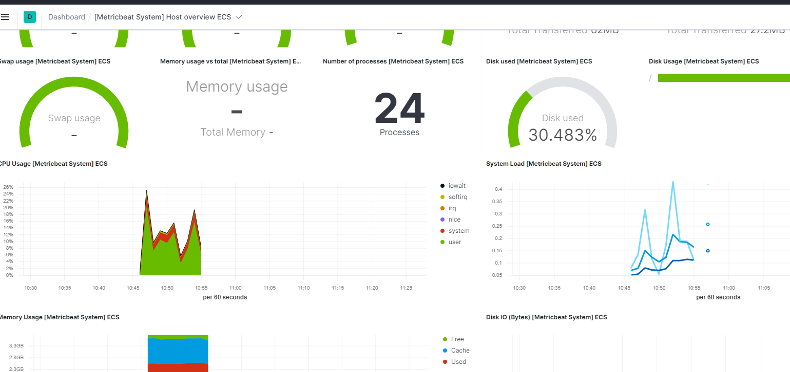

## 1.	Cài đặt
```console
Link tham khảo: https://www.elastic.co/guide/en/beats/filebeat/7.17/filebeat-installation-configuration.html 
cd /home/elasticsearch
wget https://artifacts.elastic.co/downloads/beats/metricbeat/metricbeat-7.12.0-linux-x86_64.tar.gz
tar -xvzf metricbeat-7.12.0-linux-x86_64.tar.gz
ln -s /home/elasticsearch/metricbeat-7.12.0-linux-x86_64 /home/elasticsearch/metricbeat
cd /home/elasticsearch/metricbeat
```
Các lệnh chạy:
```console
# Hiển thị module Enable / Disable
./metricbeat modules list
# Bật module Nginx hoặc Tắt. 
./metricbeat modules enable docker
# (Khi bật, tên file tự đổi thành ./modules.d/nginx.yml. Khi tắt, tên file được rename thành ./modules.d/nginx.yml.disabled Sau đó vào thư mục module custome lại đường dẫn log nếu cần,mặc định là /var/log/nginx/*.log)
```
Setup filebeat: Chức năng đẩy các template dashboard lên Kibana (phải đợi chạy xong, nó sẽ tự thoát 1-2 phút)
```console
./metricbeat setup
```
## 2.	File cấu hình filebeat.yml
```console
[root@node-1 metricbeat]# cat metricbeat.yml  | grep -v '#' | grep -v ^$
metricbeat.config.modules:
  path: ${path.config}/modules.d/*.yml
  reload.enabled: false
setup.template.settings:
  index.number_of_shards: 1
  index.codec: best_compression
setup.kibana:
  host: "192.168.88.18:5601"
output.elasticsearch:
  hosts: ["192.168.88.18:9200","192.168.88.12:9200","192.168.88.13:9200"]
  username: "elastic"
  password: "123456"
processors:
  - add_host_metadata: ~
  - add_cloud_metadata: ~
  - add_docker_metadata: ~
  - add_kubernetes_metadata: ~
```
## 3.	Debug filebeat khi lỗi
```console
./metricbeat -e -v -d '*'
```

## 5.	Systemd

```console
[Unit]
Description=Metricbeat

[Service]
ExecStart=/usr/share/metricbeat/bin/metricbeat -c /etc/metricbeat/metricbeat.yml
Restart=always
User=root
Group=root

[Install]
WantedBy=multi-user.target
```

Kết quả:
