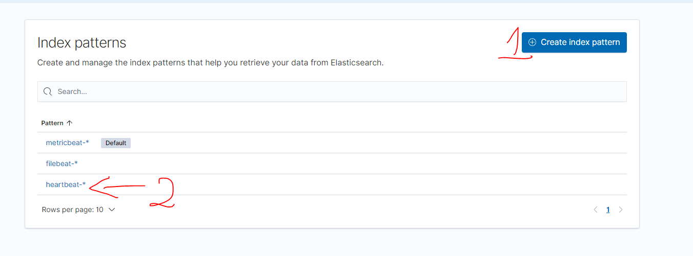

## 1.	Cài đặt

Link tham khảo: https://www.elastic.co/guide/en/beats/filebeat/7.17/filebeat-installation-configuration.html 
```
cd /home/elasticsearch
wget https://artifacts.elastic.co/downloads/beats/heartbeat/heartbeat-7.12.0-linux-x86_64.tar.gz
tar -xvzf heartbeat-7.12.0-linux-x86_64.tar.gz
ln -s /home/elasticsearch/heartbeat-7.12.0-linux-x86_64 /home/elasticsearch/heartbeat
cd /home/elasticsearch/heartbeat
```

Các lệnh chạy:
```
# Setup filebeat: Chức năng đẩy các template dashboard lên Kibana (phải đợi chạy xong, nó sẽ tự thoát 1-2 phút)
./heartbeat setup
```
## 2.	File cấu hình filebeat.yml
```
[root@node-1 heartbeat]# cat heartbeat.yml  | grep -v '#' | grep -v ^$
heartbeat.config.monitors:
  path: ${path.config}/monitors.d/*.yml
  reload.enabled: false
  reload.period: 5s
heartbeat.monitors:
- type: http
  id: my-monitor
  name: My Monitor
  urls: ["http://localhost:9200"]
  schedule: '@every 10s'
- type: icmp
  schedule: '@every 5s'
  hosts: ["example.com"]
- type: http
  schedule: '@every 10s'
  urls: ["http://example.com"]

setup.template.settings:
  index.number_of_shards: 1
  index.codec: best_compression
setup.kibana:
output.elasticsearch:
  hosts: ["192.168.88.18:9200","192.168.88.12:9200","192.168.88.13:9200"]
  username: "elastic"
  password: "123456"
processors:
  - add_observer_metadata:
```
## 3.	Debug filebeat khi lỗi
```
./heartbeat -e -v -d '*'
```
## 4.	Start filebeat bằng tay
```
./heartbeat -e
```


## 5.	Systemd
```
vim /etc/systemd/system/heartbeat.service
[Unit]
Description=Heartbeat

[Service]
ExecStart=/home/elasticsearch/heartbeat/heartbeat -e -c /home/elasticsearch/heartbeat/heartbeat.yml
Restart=always
User=root
Group=root

[Install]
WantedBy=multi-user.target
```
6.	Tạo index cho heartbeat trong ES trước khi sử dụng.

 
