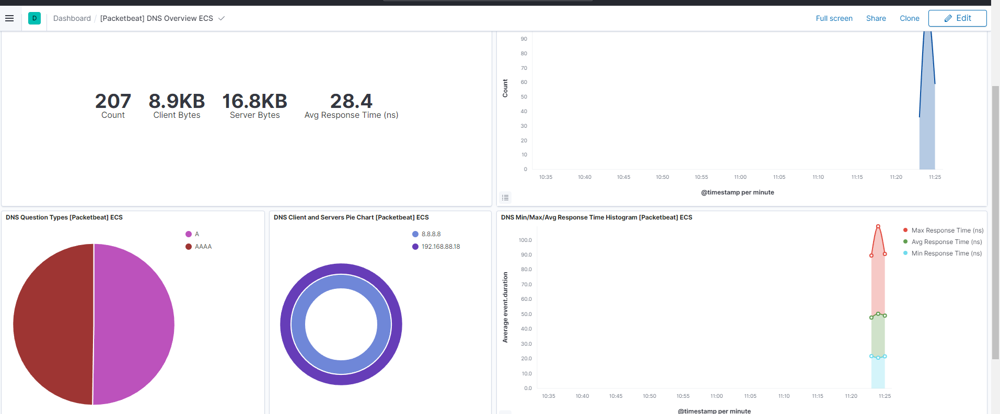

## 1.	Cài đặt
Link tham khảo: https://www.elastic.co/guide/en/beats/filebeat/7.17/filebeat-installation-configuration.html 
cd /home/elasticsearch
```
wget https://artifacts.elastic.co/downloads/beats/packetbeat/packetbeat-7.12.0-linux-x86_64.tar.gz
mv packetbeat-7.12.0-linux-x86_64.tar.gz /home/elasticsearch/
tar -xvzf packetbeat-7.12.0-linux-x86_64.tar.gz
ln -s /home/elasticsearch/packetbeat-7.12.0-linux-x86_64 /home/elasticsearch/packetbeat
cd /home/elasticsearch/packetbeat
```
Các lệnh chạy:
```
# Setup filebeat: Chức năng đẩy các template dashboard lên Kibana (phải đợi chạy xong, nó sẽ tự thoát 1-2 phút)
./packetbeat setup
```
## 2.	File cấu hình filebeat.yml
```
[root@node-1 packetbeat]# cat packetbeat.yml  | grep -v '#' | grep -v ^$
packetbeat.interfaces.device: any
packetbeat.interfaces.internal_networks:
  - private
packetbeat.flows:
  timeout: 30s
  period: 10s
packetbeat.protocols:
- type: icmp
  enabled: true
- type: amqp
  ports: [5672]
- type: cassandra
  ports: [9042]
- type: dhcpv4
  ports: [67, 68]
- type: dns
  ports: [53]
- type: http
  ports: [80, 8080, 8000, 5000, 8002]
- type: memcache
  ports: [11211]
- type: mysql
  ports: [3306,3307]
- type: pgsql
  ports: [5432]
- type: redis
  ports: [6379]
- type: thrift
  ports: [9090]
- type: mongodb
  ports: [27017]
- type: nfs
  ports: [2049]
- type: tls
  ports:
    - 8443
- type: sip
  ports: [5060]
setup.template.settings:
  index.number_of_shards: 1
setup.kibana:
  host: "192.168.88.18:5601"
output.elasticsearch:
  hosts: ["192.168.88.18:9200","192.168.88.12:9200","192.168.88.13:9200"]
  username: "elastic"
  password: "123456"
processors:
    if.contains.tags: forwarded
    then:
      - drop_fields:
          fields: [host]
    else:
      - add_host_metadata: ~
  - add_cloud_metadata: ~
  - add_docker_metadata: ~
  - detect_mime_type:
      field: http.request.body.content
      target: http.request.mime_type
  - detect_mime_type:
      field: http.response.body.content
      target: http.response.mime_type
```      
## 3.	Debug filebeat khi lỗi


## 4.	Start filebeat bằng tay
```
./packagebeat -e
```


## 5.	Systemd
```
[Unit]
Description=Packetbeat

[Service]
ExecStart=/usr/share/packetbeat/bin/packetbeat -c /etc/packetbeat/packetbeat.yml
Restart=always
User=root
Group=root

[Install]
WantedBy=multi-user.target
```

## 6.	Ứng dụng


