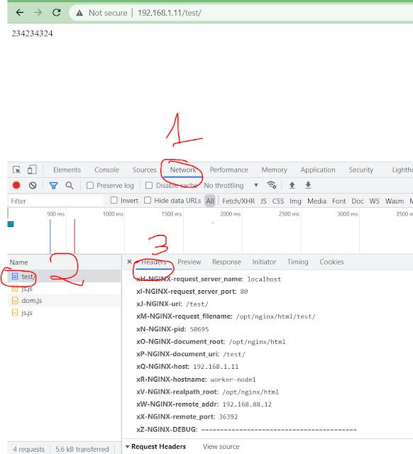

Tùy biến Nginx logs
---
> Bài toàn đặt ra:   
> Nginx default logs chưa đủ để truy vết hệ thống, debug lỗi khi backend hoạt động không ổn định, hoặc chỉnh lại format để đẩy lên ELK search. Sau đây tôi đưa các bạn đi chỉnh sửa cơ bản nginx logs.


Đầu tiên, ta chuẩn bị 1 lệnh gọi nginx xuyên suốt quá trình để test toàn bộ các config:
```console
curl -XPOST -H 'X-Forwarded-For: 199.199.199.199'  -H 'Content-Type: application/json' -H 'Host: ahihi.com' -d '{"login":"my_login","password":"my_password"}' http://localhost/index.jsp?tuanda=123
```
## Mẫu log 1: default_log
```console
log_format  main '$remote_addr - $remote_user [$time_local] "$request" '
                  '$status $body_bytes_sent "$http_referer" '
                  '"$http_user_agent" "$http_x_forwarded_for"';

access_log  logs/access.log  main;
```
Log with Config_1: Log ta nhận được như sau:
```console
192.168.88.12 - - [23/Feb/2022:20:51:12 -0500] "POST /index.jsp?tuanda=123 HTTP/1.1" 200 105 "-" "curl/7.29.0" "199.199.199.199, ::1"
```

## Mẫu log 2: request_time và response_time
> $request_time: Thời gian phản hồi client, đơn vị milisec  
> $upstream_response_time để kiểm tra thời gian upstream phản hồi. Chỉ hiển thị khi dùng proxy_pass.  
```console
log_format  default  '$remote_addr - $remote_user [$time_local] "$request" '
                     '$status $body_bytes_sent "$http_referer" '
                     '"$http_user_agent" Request_time:$request_time Upstream_response_time:$upstream_response_time "$http_x_forwarded_for"';
```
Log với Config_2:
```console
192.168.88.12 - - [23/Feb/2022:21:11:49 -0500] "POST /index.jsp?tuanda=123 HTTP/1.1" 200 4 "-" "curl/7.29.0" Request_time:0.009 UpStream_response_time:0.008 "199.199.199.199, ::1"
```
KQ:
- Thời gian phản hồi client là 0.009ms
- thời gian nginx đợi upstream backend trả lời là 0.008ms

## Mẫu log 3: Log tiết URL và Body
```console
log_format good_log1  escape=none '$remote_addr - $remote_user [$time_iso8601] "$request" '
'$status $body_bytes_sent "$http_referer" "$http_user_agent" '
'$request_time $upstream_response_time "http_x_forwarded_for: $http_x_forwarded_for" '
'Request_body: [$request_body]';


log_format good_log2 escape=none '$remote_addr - $remote_user [$time_iso8601] '
'"$request_method $scheme://$host:$server_port$request_uri $server_protocol" '
'$status $body_bytes_sent "$http_referer" "$http_user_agent" '
'$request_time $upstream_response_time "http_x_forwarded_for: $http_x_forwarded_for" '
'Request_body: [$request_body]';

    access_log  logs/access.log   good_log1
    access_log  logs/access2.log  good_log2;
```
với good_log1 ta có:
```console
192.168.88.12 - - [2022-02-23T22:21:32-05:00] "POST /index.jsp?tuanda=123 HTTP/1.1" 200 4 "-" "curl/7.29.0" 0.003 0.002 "http_x_forwarded_for: 199.199.199.199, 127.0.0.1" Request_body: [{"login":"my_login","password":"my_password"}]
```
với good_log2 ta có:
```console
192.168.88.12 -  [2022-02-23T23:36:27-05:00] "POST http://ahihi.com:80/index.jsp?tuanda=123 HTTP/1.1" 200 4 "" "curl/7.29.0" 0.002 0.001 "http_x_forwarded_for: 199.199.199.199, 127.0.0.1" Request_body: [{"login":"my_login","password":"my_password"}]
```
## Mẫu Log 4: Log as json:
```console
log_format good_json  escape=none
  '{'
    '"time_local":"$time_iso8601",'
    '"remote_addr":"$remote_addr",'
    '"remote_user":"$remote_user",'
    '"request":"$request_method $scheme://$host$request_uri $server_protocol",'
    '"status": "$status",'
    '"body_bytes_sent":"$body_bytes_sent",'
    '"http_referer":"$http_referer",'
    '"http_user_agent":"$http_user_agent",'
    '"request_time":"$request_time",'
    '"upstream_response_time":"$upstream_response_time",'
    '"http_x_forwarded_for":"$http_x_forwarded_for",'
    '"request_body":[$request_body]'
  '}';
```

Logs result from config 4:
```console
{
  "time_local": "2022-02-23T23:24:00-05:00",
  "remote_addr": "192.168.88.12",
  "remote_user": "",
  "request": "POST http://ahihi.com/index.jsp?tuanda=123 HTTP/1.1",
  "status": "200",
  "body_bytes_sent": "4",
  "http_referer": "",
  "http_user_agent": "curl/7.29.0",
  "request_time": "0.003",
  "upstream_response_time": "0.001",
  "http_x_forwarded_for": "199.199.199.199, 127.0.0.1",
  "request_body": [
    {
      "login": "my_login",
      "password": "my_password"
    }
  ]
}
```

## Mẫu log 5: (All) toàn bộ embed variable của nginx:
http://nginx.org/en/docs/http/ngx_http_core_module.html#variables

```console
log_format main3 'args:$args '
' binary_remote_addr:$binary_remote_addr '
' body_bytes_sent:$body_bytes_sent '
' bytes_sent:$bytes_sent '
' connection:$connection '
' connection_requests:$connection_requests '
' connection_time:$connection_time '
' content_length:$content_length '
' content_type:$content_type '
' cookie_name:$cookie_name '
' document_root:$document_root '
' document_uri:$document_uri '
' host:$host '
' hostname:$hostname '
' http_name:$http_name '
' https:$https '
' is_args:$is_args '
' limit_rate:$limit_rate '
' msec:$msec '
' nginx_version:$nginx_version '
' pid:$pid '
' pipe:$pipe '
' proxy_protocol_addr:$proxy_protocol_addr '
' proxy_protocol_port:$proxy_protocol_port '
' proxy_protocol_server_addr:$proxy_protocol_server_addr '
' proxy_protocol_server_port:$proxy_protocol_server_port '
' query_string:$query_string '
' realpath_root:$realpath_root '
' remote_addr:$remote_addr '
' remote_port:$remote_port '
' remote_user:$remote_user '
' request:$request '
' request_body:$request_body '
' request_body_file:$request_body_file '
' request_completion:$request_completion '
' request_filename:$request_filename '
' request_id:$request_id '
' request_length:$request_length '
' request_method:$request_method '
' request_time:$request_time '
' request_uri:$request_uri '
' scheme:$scheme '
' sent_http_name:$sent_http_name '
' sent_trailer_name:$sent_trailer_name '
' server_addr:$server_addr '
' server_name:$server_name '
' server_port:$server_port '
' server_protocol:$server_protocol '
' status:$status '
' time_iso8601:$time_iso8601 '
' time_local:$time_local '
' uri:$uri ';

access_log  logs/access.log  main_z;
```

Logs result from config 5:
```console
args:tuanda=123  binary_remote_addr:\xC0\xA8X\x0C  body_bytes_sent:4  bytes_sent:237  connection:71  connection_requests:1  connection_time:0.005  content_length:45  content_type:application/json  cookie_name:-  document_root:/opt/nginx/html  document_uri:/index.jsp  host:ahihi.com  hostname:worker-node1  http_name:-  https:  is_args:?  limit_rate:0  msec:1645669915.708  nginx_version:1.21.6  pid:87196  pipe:.  proxy_protocol_addr:-  proxy_protocol_port:-  proxy_protocol_server_addr:-  proxy_protocol_server_port:-  query_string:tuanda=123  realpath_root:/opt/nginx/html  remote_addr:192.168.88.12  remote_port:41914  remote_user:-  request:POST /index.jsp?tuanda=123 HTTP/1.1  request_body:{\x22login\x22:\x22my_login\x22,\x22password\x22:\x22my_password\x22}  request_body_file:-  request_completion:OK  request_filename:/opt/nginx/html/index.jsp  request_id:b666a73ccf0cafb68efbe7128bd9c3c3  request_length:341  request_method:POST  request_time:0.004  request_uri:/index.jsp?tuanda=123  scheme:http  sent_http_name:-  sent_trailer_name:-  server_addr:192.168.88.13  server_name:localhost  server_port:80  server_protocol:HTTP/1.1  status:200  time_iso8601:2022-02-23T21:31:55-05:00  time_local:23/Feb/2022:21:31:55 -0500  uri:/index.jsp
```

# PHẦN 2: Debug trả về với response header của Nginx:
Ngoài việc show các trường trong log. Ta có thể đính kèm header response cho client, bằng việc thêm header vào location như sau:

```console
location /test/ {
add_header x0-NGINX-DEBUG '=========================================';
add_header x1-NGINX-http_user_agent $http_user_agent;
add_header xA-NGINX-http_cookie $http_cookie;
add_header xB-NGINX-request $request;
add_header xC-NGINX-request_body $request_body;
add_header xD-NGINX-request_method $request_method;
add_header xE-NGINX-request_time $request_time;
add_header xF-NGINX-request_uri $request_uri;
add_header xG-NGINX-scheme $scheme;
add_header xH-NGINX-request_server_name $server_name;
add_header xI-NGINX-request_server_port $server_port;
add_header xJ-NGINX-uri $uri;
add_header xK-NGINX-args $args;
add_header xL-NGINX-is_args $is_args;
add_header xM-NGINX-request_filename $request_filename;
add_header xN-NGINX-pid $pid;
add_header xO-NGINX-document_root $document_root;
add_header xP-NGINX-document_uri $document_uri;
add_header xQ-NGINX-host $host;
add_header xR-NGINX-hostname $hostname;
add_header xS-NGINX-proxy_protocol_addr $proxy_protocol_addr;
add_header xT-NGINX-proxy_protocol_port $proxy_protocol_port;
add_header xU-NGINX-query_string $query_string;
add_header xV-NGINX-realpath_root $realpath_root;
add_header xW-NGINX-remote_addr $remote_addr;
add_header xX-NGINX-remote_port $remote_port;
add_header xY-NGINX-remote_user $remote_user;
add_header xZ-NGINX-DEBUG '=========================================';

 proxy_pass http://127.0.0.1:8080/test/;

}
```
Ta thực hiện vào Browser Chrome, chọn F12 debug, chọn Network . ấn F5 để refresh lại trang. Và click vào Header để đọc:




---
Nguồn tham khảo:  
- http://nginx.org/en/docs/http/ngx_http_core_module.html#variables  
- https://azimut7.com/blog/nginx-variables-debug  
- https://nginxconfig.io/  