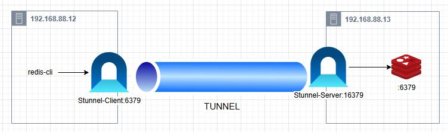
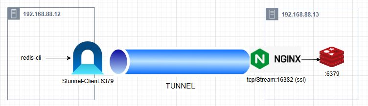

# LAB_1 [Stunnel_Server]/[Stunnel_Client]
Diagram:

### Step1: Setup Stunnel Server
```console
#Install Stunnel & Redis
apt-get install redis-server stunnel4

#Create SSL 
openssl genrsa -out /etc/stunnel/key.pem 4096
openssl req -new -x509 -key /etc/stunnel/key.pem -out /etc/stunnel/cert.pem -days 1826
cat /etc/stunnel/key.pem /etc/stunnel/cert.pem > /etc/stunnel/private.pem
chmod 640 /etc/stunnel/key.pem /etc/stunnel/cert.pem /etc/stunnel/private.pem

cat << EOF > /etc/stunnel/stunnel-redis.conf
pid = /var/run/stunnel.pid
[redis]
client = no
cert = /etc/stunnel/private.pem
accept = 16379
connect = 127.0.0.1:6379
EOF

systemctl start stunnel4
systemctl enable stunnel4
```

### Step2: Setup Stunnel Client
```console
apt-get install redis-tools stunnel4
# Copy /etc/stunnel/private.pem from server -> to client

cat << EOF > /etc/stunnel/stunnel-redis.conf
pid = /var/run/stunnel.pid
[redis]
client = yes
cert = /etc/stunnel/private.pem
accept = 6379
connect = 192.168.88.12:16379
EOF

systemctl stop stunnel4
systemctl start stunnel4
systemctl enable stunnel4
```

### Step3: Test
Run redis-cli on client machine
```console
# redis-cli 
127.0.0.1:6379> info
redis_version:6.0.16
```


 
# LAB_2 [Nginx TCP-Stream-SSL] / [Stunnel Client]
Diagram:

### Step1: Setup Nginx Server
```console
#Create SSL
openssl genrsa -out /etc/stunnel/key.pem 4096
openssl req -new -x509 -key /etc/stunnel/key.pem -out /etc/stunnel/cert.pem -days 1826
cat /etc/stunnel/key.pem /etc/stunnel/cert.pem > /etc/stunnel/private.pem
chmod 640 /etc/stunnel/key.pem /etc/stunnel/cert.pem /etc/stunnel/private.pem


# Install NGINX
apt-get install nginx libnginx-mod-stream
stream {
    server {
        listen 16382 ssl;
        proxy_pass 127.0.0.1:6379;

        # Cấu hình SSL/TLS
        ssl_certificate /etc/stunnel/cert.pem;
        ssl_certificate_key /etc/stunnel/key.pem;
        #ssl_trusted_certificate /path/to/ca_cert.crt;
    }
}
```

### Step2: Setup Stunnel Client
```console
apt-get install redis-tools stunnel4
#Copy /etc/stunnel/private.pem from server -> to client

cat << EOF > /etc/stunnel/stunnel-redis.conf
pid = /var/run/stunnel.pid
[redis]
client = yes
cert = /etc/stunnel/private.pem
accept = 6379
connect = 192.168.88.12:16382
EOF

systemctl stop stunnel4
systemctl start stunnel4
systemctl enable stunnel4
```

### Step3: Test
Run redis-cli on client machine
```console
# redis-cli 
127.0.0.1:6379> info
redis_version:6.0.16
```